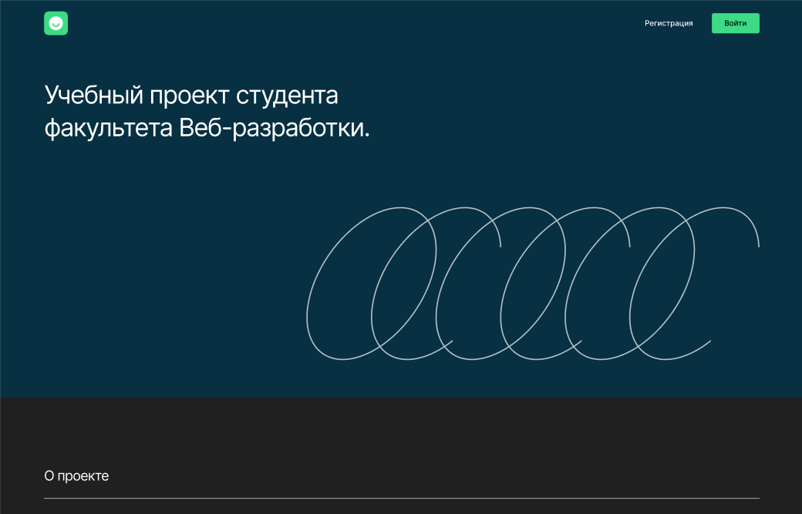

# Дипломный проект: Movies Explorer (React) от _"Yandex Practicum"_.

Дипломный проект "Movies Explorer" представляет собой веб-приложение, созданное с использованием React, которое позволяет пользователям открывать увлекательный мир кино. С приложением вы можете легко находить информацию о различных фильмах, исследовать новые кинематографические шедевры и сохранять свои любимые фильмы для последующего просмотра. [Ссылка на макет в Figma(dark-1)](https://www.figma.com/file/6FMWkB94wE7KTkcCgUXtnC/%D0%94%D0%B8%D0%BF%D0%BB%D0%BE%D0%BC%D0%BD%D1%8B%D0%B9-%D0%BF%D1%80%D0%BE%D0%B5%D0%BA%D1%82?type=design&node-id=1-6015&mode=design&t=QrcqYAWl02BAIGYW-0)



## Структура проекта:

* Movies Explorer (версия React) - этот репозиторий 
* [Movies Explorer (версия для сервера)](https://github.com/Dmitry145528/movies-explorer-api)

## Что сделал:

* Разработал пользовательский интерфейс с использованием библиотеки React.

* Создал компоненты для отображения информации о фильмах, формы поиска и фильтрации.

* Настроил маршрутизацию с использованием React Router для перехода между страницами приложения.

* Интегрировал внешний API для получения данных о фильмах.

* Реализовал функционал сохранения и удаления фильмов в избранном с использованием локального хранилища браузера.

* Создал формы для авторизации и регистрации пользователей.

* Реализовал обработку ошибок и валидацию вводимых данных.

* Настроил адаптивную вёрстку для корректного отображения на разных устройствах.

* Добавил анимации и интерактивные элементы для улучшения пользовательского опыта.

## Реализованный функционал:

* Просмотр списка фильмов с возможностью поиска и фильтрации.

* Добавление и удаление фильмов в избранное.

* Регистрация и аутентификация пользователей.

* Валидация вводимых данных на формах.

* Адаптивная вёрстка для корректного отображения на мобильных устройствах.

* Анимации и интерактивные элементы для улучшения интерфейса.

## Технологии:

1. Библиотека React + Vite для разработки пользовательского интерфейса.
2. Хуки useState и useEffect для управления состоянием компонентов и выполнения побочных эффектов.
3. CSS-фреймворк Flexbox для гибкой вёрстки.
4. Технология @font-face для подключения шрифтов.
5. CSS-фреймворк Grid-Layout для создания сложных сеток.
6. Использование относительных единиц измерения, таких как vw, vh, %, rem и em для создания адаптивных интерфейсов.
7. Использование псевдокласса :hover для интерактивных элементов.
8. Формы и валидация данных.
9. Позиционирование элементов.
10. Методология БЭМ (Nested) для именования классов CSS.
11. Адаптивная вёрстка с использованием медиазапросов @media screen.
12. Обработка массивов данных.
13. Работа с данными по умолчанию.
14. Модульная структура проекта с использованием import и export.

## Инструкция по запуску:

1. **Склонировать репозиторий:**
   ```sh
   git clone git@github.com:Dmitry145528/movies-explorer-frontend.git
   git clone https://github.com/Dmitry145528/movies-explorer-frontend.git

2. **Перейдите в директорию проекта, выполнив команду:**

   `cd movies-explorer-frontend`

3. **Установите все необходимые зависимости проекта, выполнив команду:**

   `npm install`

4. **Перед запуском проекта в режиме разработки или деплоем на хостинг, необходимо собрать проект. Для этого выполните команду:**

    `npm run build`

5.  **Вы можете запустить проект в режиме разработки, выполнив команду:**

    `npm run dev`

6. **Для просмотра оптимизированного билда для продакшн, используйте команду:**

    `npm run preview`

## Статус разработки:

✅ _Завершено_

Дальнейшая разработка ведётся в репозитории [Movies Explorer (версия для сервера)](https://github.com/Dmitry145528/movies-explorer-api)